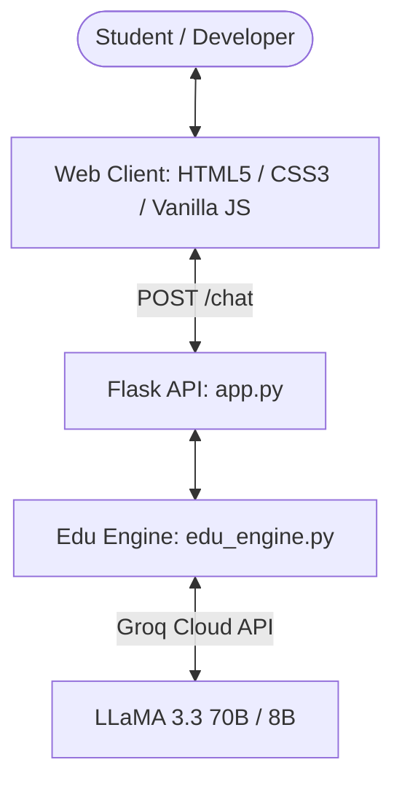

# 🎓 EduTutor AI - Intelligent Coding & Academic Mentor

[](https://python.org)
[](https://flask.palletsprojects.com/)
[](https://groq.com)
[](LICENSE)

**EduTutor AI** is a state-of-the-art educational assistant and coding mentor powered by **Groq Cloud's ultra-fast LLaMA 3.3 70B** model. Designed to help learners, developers, and students master complex computer science, programming, and academic concepts through personalized, step-by-step guidance.

---

## ✨ Features

- ⚡ **Ultra-Fast AI Inference**: Powered by `llama-3.3-70b-versatile` with automated fallback to `llama-3.1-8b-instant`.
- 🎨 **5 Curated Themes**:
  - 🌌 **Midnight Cyber** (Default glassmorphism)
  - 🖤 **Onyx Emerald** (AMOLED deep black)
  - 🟣 **Synthwave Velvet** (Neon violet glow)
  - 🌊 **Ocean Glacier** (Deep navy & aqua)
  - ☀️ **Daylight Clean** (Crisp modern light mode)
- 🎚️ **Depth / Complexity Levels**:
  - 👶 **Simple (ELI5)**: Jargon-free explanations with everyday analogies.
  - 🎓 **Balanced**: Approachable structure with clear code examples.
  - 🔬 **Deep**: Low-level mechanics, edge cases, and performance tradeoffs.
- 🤖 **4 Dedicated Tutor Personas**:
  - 🤖 **Balanced Mentor**: Holistic step-by-step learning.
  - 💻 **Code Specialist**: Clean syntax, debugging, and software architecture.
  - 🧠 **Concept Explainer**: Mental models and analogies first.
  - 🧪 **Quiz & Exam Prep**: Interactive challenge questions and tests.
- 🎙️ **Voice Input**: Web Speech API speech-to-text directly from the chat input.
- 🔊 **Read Aloud (TTS)**: Clean DOM-level text-to-speech synthesis with 1-click controls.
- 📋 **1-Click Copy**: Copy entire responses or isolated code snippets with syntax highlighting.
- 💡 **Smart Follow-Up Chips**: Context-aware prompts at the end of every answer to keep learning seamless.
- 📥 **Markdown Session Export**: Download complete study sessions as formatted `.md` files.

---

## 🏗️ Architecture



---

## 🚀 Quickstart Guide

### 1. Clone the Repository
```bash
git clone https://github.com/YOUR_USERNAME/EduTutorAI.git
cd EduTutorAI
```

### 2. Create and Activate a Virtual Environment
```bash
# Windows
python -m venv venv
venv\Scripts\activate

# macOS / Linux
python3 -m venv venv
source venv/bin/activate
```

### 3. Install Dependencies
```bash
pip install -r requirements.txt
```

### 4. Configure Your API Key
Create a `.env` file in the root directory (or copy from `.env.example`):
```env
GROQ_API_KEY=your_groq_api_key_here
```
> 🔑 Get a free API key at [Groq Console](https://console.groq.com/keys).

### 5. Run the Application
```bash
python app.py
```
Open **`http://127.0.0.1:5000`** in your browser.

---

## 📁 Project Structure

```
EduTutorAI/
├── app.py                 # Flask server & API route endpoints
├── edu_engine.py          # AI tutoring core & Groq LLM integration
├── requirements.txt       # Python dependencies
├── .env.example           # Environment template
├── .gitignore             # Git ignore rules
├── templates/
│   └── index.html         # Responsive web application interface
└── static/
    ├── style.css          # Multi-theme design system & styles
    └── script.js          # Client-side chat logic, TTS & events
```

---

## 📄 License
MIT License. Feel free to use, modify, and distribute for educational purposes!
